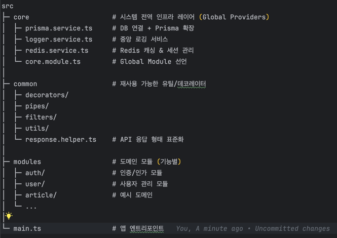

# 🏗️ Architecture Overview

이 프로젝트는 확장성과 유지보수성을 고려하여 다음과 같이 구조화되어 있습니다.

# DB 설계
##  id값을 PK로 사용했을 경우 장점
1. 각각의 테이블 간에 데이터 일관성을 유지하기 쉽다. 데이터가 중복되거나 혼동될 가능성이 줄어든다.
2. 정수형 id 칼럼은 비교적 작은 크기를 가지고 있어 인덱싱 및 조회 성능이 우수하다. 즉, 조회속도나 DB 작업 속도가 향상 된다.
3. 특히, 대규모 데이터베이스에서 중요한 장점으로 작용한다. 추후 샤딩이나 파티셔닝 같이 데이터를 쪼개고 나눌때 등등 효과적이다.

## 테이블

### 테이블명, 컬럼명 
- CamelCase 안쓰고 SnakeCase로 변경해서 사용하는 이유는 예전 AWS RDS 마이그레이션할때 컬럼이랑 테이블명을 CamelCase로 썼을때 제약이 있었기 때문
- 많은 데이터베이스에서는 대소문자 구분 안해서 대소문자 섞어서 쓰면 혼란스러운데 스네이크케이스로 가독성과 일관성을 챙길수있다.

### 설계
- user - account(계정)은 1:N 으로 둬서 oauth 로그인 지원
- verification - 이메일로 인증할때 여러 경우의 수 제어
- refreshToken - refreshToken 및 다중로그인 관리
- tag,channel 은 공통으로 두고 별도 테이블에서 구독해나가는 방식으로 구현
- reference 은 각개 유저별로 사용하게 구현
- channelhistory - 공통channel에서 데이터 가져와서 스케줄러로 쌓는 식으로 구현
- 